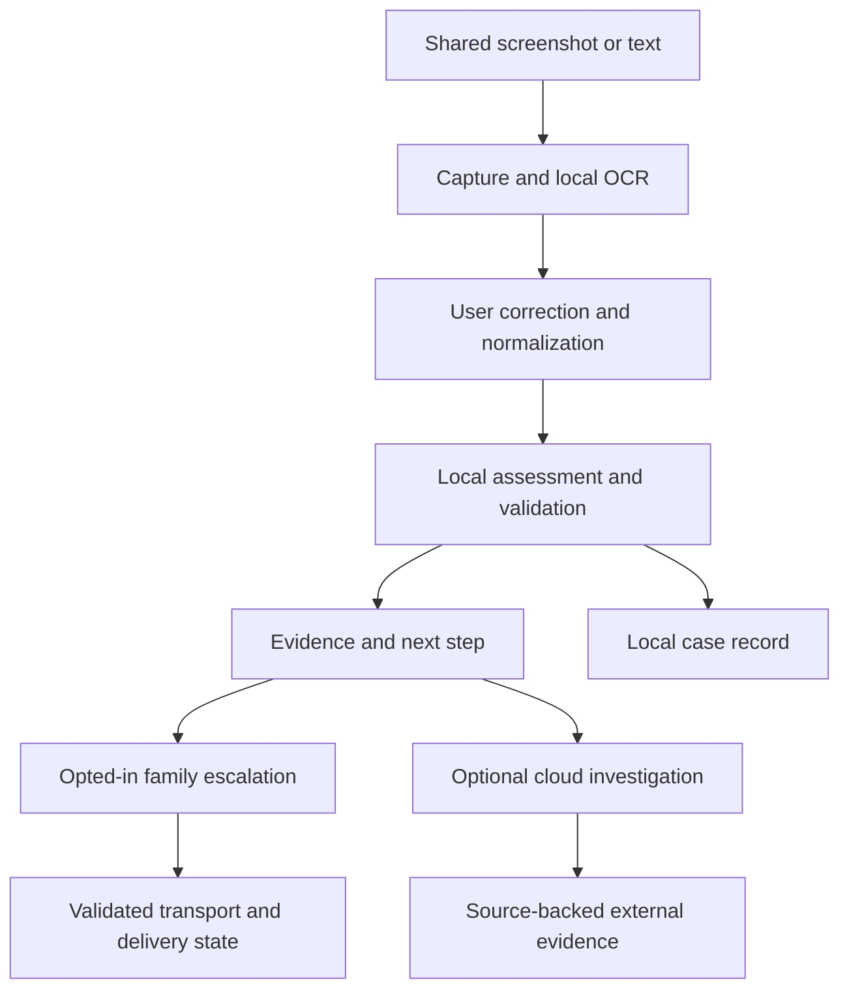

# Suri architecture and AI responsibilities

## Implemented build direction

The native SwiftUI app is in `SuriApp`, its lightweight import extension in `SuriShareExtension`, and deterministic domain/policy code in the `SuriCore` Swift package. Qwen3 1.7B Q4_K_M runs through a small C++ bridge to llama.cpp b11527 CPU. MLX was removed from the active project because its documented simulator limitation was reproduced during testing. Vision OCR runs independently off the UI actor.

The result schema uses fixed action/pattern/category enums and source-mapped evidence quotes. Two local model calls separate code-handling reading comprehension from the full assessment. Deterministic policy reconciles the narrow delivery-versus-disclosure contradiction and rejects other inconsistent output. Case and OCR whitespace-only quote variations map back to actual source spans; changed or invented words fail validation. One bounded local retry is allowed. Generation is grammar-constrained, inference is cancellable with a 120-second overall bound, and input is bounded rather than silently truncated. A bounded internal reasoning stage is discarded, never displayed or logged. None of this establishes calibrated accuracy or injection immunity.

The app uses a bounded, file-protected local JSON history, pruned on launch (7-day expiry, 50 records), and Keychain for the selected family phone number and gateway access token. It saves assessment evidence, not screenshots or complete messages. The Share Extension writes a protected App Group inbox, removes content when imported, and prunes one-hour expired imports on the next inbox access. It does not run the model, launch a background scan, or programmatically force the main app open.

`gateway` is an optional Node 24 service using OpenAI Responses with a strict category-only input schema. Unknown fields are rejected. It returns pattern guidance with approved reference IDs from a dated pack, not live website reputation. Cloud access is off by default, opt-in, revocable, network-policy constrained, and never required by local inference. Live provider execution awaits user credential configuration.

**Automation (implemented 10 October 2026):** `CheckMessageLocallyIntent` → `AutomationService` (opt-in and consent check, deterministic input guards, a salted duplicate ledger, a UIKit background-time request) → `LocalAnalyzer` → `CaseStore` → `UNUserNotificationCenter`. The intent answers Shortcuts within 20 seconds while the check finishes in the background. A deterministic pre-screen in `SuriCore.AutomationPolicy` decides whether to post an instant heads-up, which the result replaces in place. `CheckCopiedMessageIntent` opens the app and checks the clipboard only on request. Notification copy lives in `SuriCore` and is unit-tested to contain no message content.

The proposed architecture below remains useful for future expansion; it must not be read as a list of implemented integrations.

## Proposed architecture

The default design is a native SwiftUI iPhone app with a local analysis service and optional cloud gateway. The cloud/backend provider and model are undecided. Start with one complete main-app path, then add extensions after feasibility checks.

## Service boundaries

| Service | Responsibility |
| --- | --- |
| CaptureService | Import only the user's chosen content or a validated automation input |
| OCRService | Extract text and image coordinates on-device |
| InputNormalizer | Preserve raw text while producing a normalized analysis representation |
| LocalAnalyzer | Identify requested actions and supported warning signs |
| AssessmentValidator | Verify schema, evidence spans, category values, and consistency |
| GuidanceStore | Retrieve dated, sourced verification material |
| CloudInvestigator | Analyze explicitly approved content and return external evidence |
| EscalationPolicy | Apply consent and deterministic alert rules |
| AlertDispatcher | Execute one selected transport with idempotency and status tracking |
| CaseStore | Save only allowed records under retention settings |

Keep capture, evidence extraction, and alert policy independent of an inference provider. Domain models should not depend on vendor response formats. SwiftData or SQLite is a candidate for persistence; extension sharing and concurrency requirements determine the final choice. Do not rely on unsupported shared storage for a carrier-message filter.

## Local model strategy

Candidate components are Apple Vision OCR, a compact text classifier or evaluated language model, deterministic URL/text checks, and retrieved guidance. Foundation Models is a candidate on eligible ready systems; a custom Core ML model is another path. Availability, memory, language coverage, model license, and the target execution environment must be tested.

Do not assume a general language model is a trained scam detector. Do not present hardcoded rules as learned semantic inference. A rules-only fallback must be visibly scoped, and a mock analyzer must be marked Demo rather than counted as working local AI.

For extension paths, start with lightweight work and measure resource use. Main-app analysis can support richer explanations. Keep inference off the UI thread and cancel old analysis when the user changes the input.

## Structured assessment

Proposed assessment fields:

| Field | Meaning |
| --- | --- |
| assessmentID and schemaVersion | Identity and format version |
| sourceID and inputRevision | Link to the exact user-reviewed input |
| inputQuality | Complete, partial, or unreadable |
| requestedActions | Actions visibly requested by the message |
| riskCategory | Warning signs found, needs verification, or no obvious warning signs |
| warningSigns | Code, explanation, and evidence span/quote |
| uncertainties | Explicitly unresolved facts |
| verificationSteps | Guidance with an approved reference identifier |
| analysisMethod and modelVersion | What actually produced the result |
| analyzedAt and referencePackVersion | Time and data provenance |

Evidence must match the extracted text. If validation fails, retry within a bounded policy or return Could not complete check. Do not fill missing evidence with a model's plausible explanation. A corrected input invalidates the old result and any unsubmitted escalation based on it.

## Analysis sequence

1. Receive selected content; validate file type and size.
2. Extract text locally. Preserve readable originals only under the retention policy.
3. Ask for correction when material fields are ambiguous.
4. Parse URLs and requested actions without opening links.
5. Retrieve applicable downloaded guidance.
6. Run local inference with scanned text treated as untrusted data.
7. Validate the returned assessment and evidence.
8. Render result, then separately evaluate escalation eligibility.
9. If the user enables an online investigation, create a previewable minimized request.
10. Attach cloud evidence to the same input revision; do not silently overwrite the local assessment.

## Cloud responsibilities

Cloud AI may compare approved content with published advisories or analyze more context. A reputation provider and public-source retrieval are separate data services. An LLM's memory is not a live reputation database. A result without a source is not independently verified evidence.

The gateway holds provider secrets, enforces request limits, authenticates family-related actions, and returns bounded typed responses. Freshness, query scope, and failure status must accompany external evidence. Local checking must not require the gateway's authentication, availability, or quota.

Do not fetch an arbitrary user-submitted URL from the phone just to classify the message. Server-side investigation needs an allowlist of protocols, blocked private/reserved destinations, validated redirects, size/time limits, and no execution of untrusted scripts. URLs can contain private tokens; preview and minimize them before transmission.

## Local and cloud disagreement

Preserve both results and explain their scopes. A message can contain a concerning request even if its domain has no negative reputation record. Lack of a threat report must not erase local evidence. Conversely, urgency alone must not become a scam verdict. Do not simply take the most alarming model response.

## Alert and automation architecture

The host app, Share Extension, App Intents, and an eventual Message Filter are separate execution contexts. Their permissions and lifetime differ. Use IOS_CAPABILITIES.md as the integration contract.

Alert dispatch takes a validated assessment, a configured recipient, and an explicit policy decision. It does not take arbitrary destinations or message bodies directly from model output. Persist a stable alert identity and state; retries should not create duplicate alerts. A result returned from a Shortcut is not evidence that a Send Message action completed.

## Observability

Record stage timing, app/model version, source type, validation failure category, and transport state using privacy-preserving diagnostics. Do not log message bodies, screenshots, OTPs, contact identifiers, provider keys, or full URLs by default. Provide a clear developer-only mode for synthetic demo data.

## Credential and setup boundary

No API credentials or service accounts were provisioned. Before live API work, follow the applicable credential-setup workflow and resolve the provider choice. Never place cloud secrets in the iOS app, Git history, test fixtures, or screenshots.
